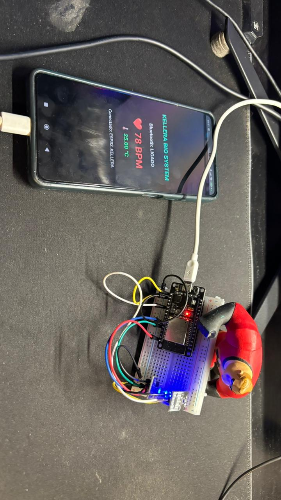

# KELLERA Ecosystem


Ecossistema de acessibilidade, inteligência artificial e interação humano-computador.

---

# 🧠 Sobre o projeto

Este repositório contém o desenvolvimento operacional do ecossistema KELLERA, incluindo:

- sistemas de acessibilidade
- interação conversacional no Android
- interpretação de sinais biológicos
- sistemas embarcados
- assistência contextual
- interação por voz
- interfaces de intenção humana

---

# 🚀 Módulos Atuais

## 👁️ KELLERA VISION

Sistema principal de acessibilidade e operação assistida por voz.

### Capacidades atuais

- abertura de aplicativos por voz
- operação hands-free
- Accessibility Service
- interação conversacional Android
- desbloqueio biométrico inicial
- arquitetura modular Android

---

## ❤️ KELLERA BIOSYSTEM

Sistema biométrico baseado em ESP32.

### Hardware atual

- ESP32 DevKit V1
- LED RGB HW-479
- Sensor DS18B20
- integração Android + sensores

---

## ⚡ KELLERA AURA

Sistema experimental de interpretação contextual humana.

### Objetivos

- leitura biométrica contextual
- interpretação emocional
- sensores ambientais
- biofeedback humano
- contexto inteligente

---

# ⚙️ Tecnologias utilizadas

- Kotlin
- Android
- ESP32
- Arduino
- Python
- Accessibility Service
- Sistemas embarcados
- Sensores biométricos

---

# 📂 Estrutura atual

```bash
app/
docs/
images/
videos/
=======

# 🧠 Sobre o projeto

Este repositório contém o desenvolvimento operacional do ecossistema KELLERA, incluindo:

• sistemas de acessibilidade  
• interação conversacional no Android  
• interpretação de sinais biológicos  
• sistemas embarcados  
• assistência contextual  
• interação por voz  
• interfaces de intenção humana  

---

# ♿ Objetivo

O KELLERA nasceu com o objetivo de reduzir a dependência visual da tecnologia.

A proposta é permitir que pessoas possam utilizar dispositivos através de intenção, voz, contexto e interação natural — reduzindo a necessidade de telas, menus e interfaces complexas.

O foco inicial está em acessibilidade para deficientes visuais, mas a visão de longo prazo envolve uma nova forma de interação humano-computador.

---

# 🚀 Capacidades Atuais

✅ desbloqueio biométrico

✅ interação conversacional no Android

✅ abertura de aplicativos por voz

✅ conversa contínua

✅ Accessibility Service

✅ operação hands-free inicial

✅ integração ESP32 + Android

✅ interpretação biométrica inicial

---

# 🧩 Módulos do Ecossistema

## 👁️ KELLERA VISION

Sistema de acessibilidade visual e operação assistida por voz.

---

## ❤️ KELLERA BIOSYSTEM

Sistema biométrico e corporal integrado ao ecossistema.

---

## ⚡ KELLERA AURA

Interpretação contextual humana através de sinais físicos, ambientais e comportamentais.

---

## 🧠 KELLERA CORE

Arquitetura central e gerenciamento dos módulos compartilhados do ecossistema.

---

# 🛠️ Tecnologias Utilizadas

• Kotlin  
• Android Studio  
• Accessibility Service  
• ESP32  
• MAX30102  
• Bluetooth  
• Sensores biométricos  
• Inteligência Artificial  
• Sistemas embarcados  

---

# 📱 Funcionalidades em Desenvolvimento

• desbloqueio inteligente por biometria

• interação contínua por voz

• automação contextual

• leitura de sinais biológicos

• interpretação de intenção humana

• integração Android + sensores

• operação assistiva para deficientes visuais

• arquitetura de interface sem toque

---

# 🔮 Visão de Longo Prazo

O objetivo do KELLERA é criar uma nova forma de interação humano-computador, reduzindo progressivamente a dependência de telas, toques e interfaces tradicionais.

A visão futura envolve:

• operação por intenção humana  
• dispositivos vestíveis inteligentes  
• integração biométrica contínua  
• computação assistiva contextual  
• acessibilidade avançada  
• interpretação comportamental  
• interação natural entre humanos e máquinas  

---

# 📸 Evolução do Projeto

## 🔧 Integração ESP32 + Sensores





# 🎥 Demonstração

[▶️ Assistir demonstração do KELLERA](./videos/kellera-demo.mp4)

---

# 🚀 Status Atual

🚧 Ecossistema em desenvolvimento contínuo

✅ Android conversacional funcional

✅ comandos de voz funcionando

✅ abertura de aplicativos por voz

✅ arquitetura modular criada

✅ integração biométrica iniciada

---

# 🤝 Propósito

O KELLERA busca tornar a tecnologia mais humana, acessível e natural.

A proposta central é permitir que pessoas utilizem dispositivos de forma mais intuitiva, especialmente usuários com limitações visuais ou motoras.

---

### KELLERA Ecosystem
### Tecnologia humana para a próxima geração de interfaces.
