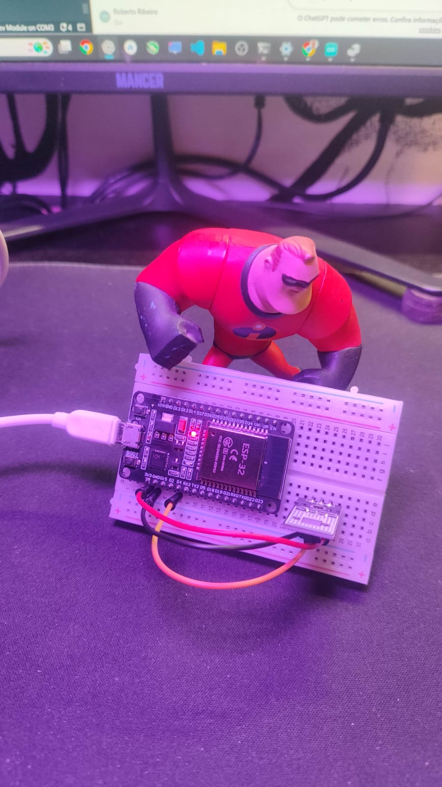
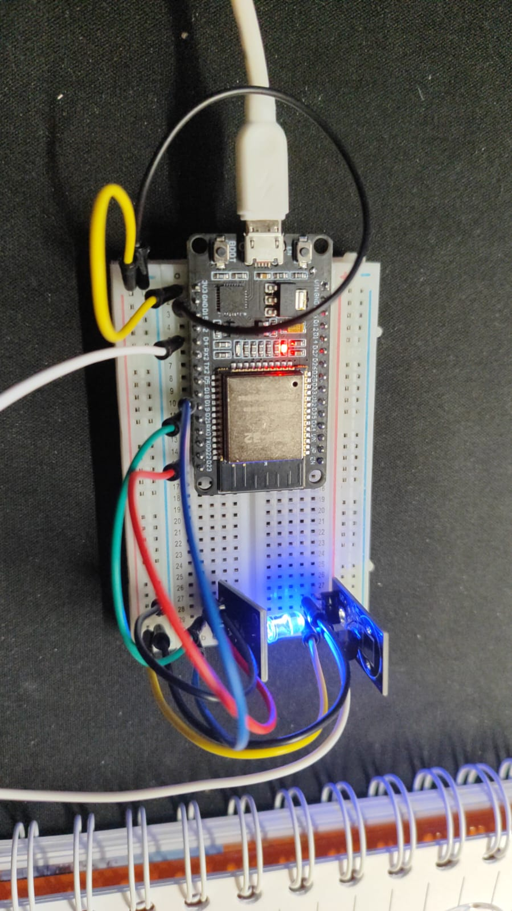

# Kellera Bio Aura System

Sistema embarcado experimental para leitura e visualização de sinais biológicos em tempo real.

## Sobre o projeto

Este projeto faz parte da iniciativa **Kellera**, cujo objetivo é desenvolver tecnologias capazes de ampliar as capacidades humanas através da interpretação de dados biológicos.

A proposta é capturar sinais do corpo humano e transformá-los em uma representação visual simples e intuitiva, permitindo melhor compreensão do estado físico e emocional.

## Objetivo

* Ler sinais biológicos em tempo real
* Interpretar esses dados
* Traduzir em uma visualização (LED / interface)

## Tecnologias utilizadas

* ESP32
* Sensor MAX30102 (batimento cardíaco)
* Sensor GSR (condutividade da pele)
* Sensor DS18B20 (temperatura)
* LED RGB

## Estrutura do projeto

```bash
hardware/
firmware/
docs/
data/
```

## Status

🚧 Em desenvolvimento (fase inicial)

## Próximos passos

* Integração dos sensores
* Leitura dos dados em tempo real
* Criação da lógica de interpretação
* Visualização através de LED
* Evolução para aplicação com interface gráfica

## Visão futura

* Interface estilo HUD (realidade aumentada)
* Aplicações em esportes e performance humana
* Uso em saúde e monitoramento
* Integração com dispositivos inteligentes

---
---

# 📸 Evolução do Projeto

## 🔧 Configuração inicial



---

## 🌈 LED RGB funcionando



---

# 🎥 Vídeos dos testes

## 🎬 Teste RGB + temperatura — Parte 1

[▶️ Assistir vídeo 1](./videos/kellera-live-biometric-system.mp4)

---

## 🎬 Teste RGB + temperatura — Parte 2

[▶️ Assistir vídeo 2](./temperature-response-vd02.mp4)

---

## 🎬 Teste RGB + temperatura — Parte 3

[▶️ Assistir vídeo 3](./videos/temperature-response-vd03.mp4)

---
**Kellera — tecnologia para ampliar capacidades humanas**
